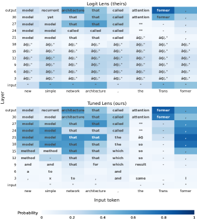

## Looking Inside the Model

We have tools for decomposing what a model does at its final layer. [Direct logit attribution](/topics/direct-logit-attribution/) tells us which components contribute to the output logits, and attention patterns show where each head directs its focus. But these tools operate on the model's final computations. What about intermediate layers? Can we peek at what the model is "thinking" as information flows from input to output?

This article covers vocabulary projection methods for reading intermediate representations: the logit lens, which applies the unembedding matrix directly to intermediate layers, and the tuned lens, which learns per-layer corrections to handle basis changes. Both are powerful observational tools, but neither can establish whether the detected information is causally necessary for the model's behavior.

## The Logit Lens

The unembedding matrix $W_U$ maps the final residual stream to vocabulary logits. The logit lens, introduced by nostalgebraist in 2020, asks a simple question: what if we applied $W_U$ to intermediate layers? 

At each layer $\ell$, we can read off what the model would predict if processing stopped at that layer:

$$
\text{LogitLens}(\mathbf{h}_\ell) = \text{LayerNorm}(\mathbf{h}_\ell) \cdot W_U
$$

This gives us a distribution over vocabulary at every layer, not just the last one.

> **Logit Lens:** The logit lens projects the intermediate residual stream $\mathbf{h}_\ell$ at layer $\ell$ through the final layer norm and unembedding matrix to produce a distribution over vocabulary. The resulting logits reveal what the model would "predict" if it stopped processing after layer $\ell$.

Consider a concrete example. When GPT-2 Small processes the prompt "The Eiffel Tower is located in the city of ___", it predicts "Paris" with 93% probability at the final layer. But at which layer does the model first "know" it will predict Paris?

The results reveal a progression. Early layers (0-3) produce near-random predictions, returning generic tokens like "the" or "of." By layer 4, geographic associations begin to appear, with "France" surfacing as a top prediction. At layer 6, "Paris" first appears as the top prediction at around 12% probability. Through layers 7-11, "Paris" stabilizes with rapidly increasing confidence, reaching 93% at the final layer.

The logit lens tells us *when* the answer appears, but not *how* the model computes it. It is a descriptive tool that shows the result of processing at each layer, revealing the trajectory without explaining the mechanism. The transition from "France" to "Paris" is interesting, but the logit lens alone cannot tell us which heads or MLPs are responsible for that transition.

### Limitations of the Logit Lens

The logit lens works well for GPT-2 but is systematically biased and fails on several other models, including GPT-Neo, BLOOM, and OPT . The reason is that intermediate layers may represent information in a rotated or shifted basis that does not align with the unembedding matrix $W_U$. The logit lens assumes intermediate representations live in the same coordinate system as the final layer. When this assumption is wrong, the projections produce misleading results.

This failure does not mean the information is absent from intermediate layers. It means the information is encoded in a different basis that the raw unembedding matrix cannot decode. This motivates a natural improvement: what if we learned a per-layer correction?

## The Tuned Lens

The tuned lens, introduced by Belrose et al. in 2023, trains a learned affine translator at each layer :

$$
\text{TunedLens}(\mathbf{h}_\ell) = (A_\ell \mathbf{h}_\ell + \mathbf{b}_\ell) \cdot W_U
$$

Each translator consists of a matrix $A_\ell$ and a bias vector $\mathbf{b}_\ell$, trained to account for how the representation basis changes from layer to layer. The affine translators correct for rotations, shifts, and stretches in the intermediate representations.

> **Tuned Lens:** The tuned lens improves on the logit lens by learning an affine probe per layer that maps intermediate representations to the final-layer basis before applying the unembedding matrix. It is more reliable and less biased, working across a wider range of models.

<figure>
  
  <figcaption>Logit lens (top) vs. tuned lens (bottom) applied to GPT-Neo-2.7B. The logit lens produces garbled predictions at early layers because intermediate representations use a different basis than the final layer. The tuned lens corrects for this, yielding coherent predictions across all layers. From Belrose et al., <em>Eliciting Latent Predictions from Transformers with the Tuned Lens</em>. </figcaption>
</figure>

A critical design choice: the translators minimize KL divergence between their output and the *final layer's* output distribution, not ground truth labels. This means the tuned lens learns to extract what the *model* knows at each layer, not what is true in the world. The distinction matters. At layer 4, the model might "believe" the answer is France. The tuned lens faithfully reports this belief, even though France is not the final answer.

The pedagogical lesson is important. The logit lens fails on some models, but this does not mean those models lack information at intermediate layers. The information is there, encoded in a different basis. The tuned lens recovers it by learning the basis correction. **Representation format matters as much as information content.**

Pause and think: What the logit lens failure tells us

The logit lens fails on some models but the tuned lens works. What does this tell us about how models represent information across layers? Does every layer use the same coordinate system?

No. Different layers can represent information in different bases. The final unembedding matrix $W_U$ is calibrated for the final layer's basis only. Intermediate layers may rotate or shift their representations freely, as long as subsequent layers can read them correctly. The tuned lens compensates for these basis changes, confirming that the information is present even when the raw projection fails. This suggests that the "residual stream as shared communication channel" view needs nuance: the channel's encoding conventions can drift across layers.

## Applications of the Logit Lens Observation

The observation that predictions refine progressively across layers has inspired several practical applications. **DoLa** (Decoding by Contrasting Layers) improves factual accuracy at inference time by contrasting the logit distributions of an early layer with a later layer . The intuition: factual knowledge emerges in later layers, so amplifying the difference between early and late predictions emphasizes the knowledge the model has acquired during processing. DoLa requires no fine-tuning and reduces hallucination rates across multiple benchmarks.

The logit lens has also revealed how multilingual models process language internally. Wendler et al.  applied vocabulary projections to multilingual LLMs and found that models process non-English inputs through an internal "concept space" that skews toward English in middle layers, even when the input and output are both in another language. The model appears to translate into an English-like representation for processing, then translate back for output.

The logit lens has also proven valuable for tracing multi-step reasoning. Yang et al.  used vocabulary projections combined with [activation patching](/topics/activation-patching/) to show that models perform latent multi-hop factual reasoning: when answering "The mother of the president of the US is ___," intermediate layers first resolve "president of the US" to a specific entity before retrieving the mother. The logit lens reveals this staged computation, with the intermediate entity appearing in vocabulary projections at middle layers before the final answer emerges.

## The Key Limitation: Observation Cannot Establish Causation

The logit lens and tuned lens show what the model would predict if processing stopped at a given layer. They reveal the trajectory of predictions across layers. But they do not tell us which components are responsible for those predictions or whether the computation at any particular layer is necessary.

The logit lens shows "Paris" at layer 8, but is the computation at layer 8 *necessary* for predicting "Paris"? These observational tools establish *correlations*: the information co-occurs with the activations. To establish *causation*, we need a different kind of experiment, one where we *intervene* on the model's internals and observe changes in behavior.

This is the shift from observation to causation. [Activation patching](/topics/activation-patching/) replaces one component's activation with an activation from a different input and measures the effect on predictions. These causal tools complete the methodological toolkit, moving us from "what exists?" to "what matters?"

**Observation reveals what exists. Only intervention reveals what matters.**
