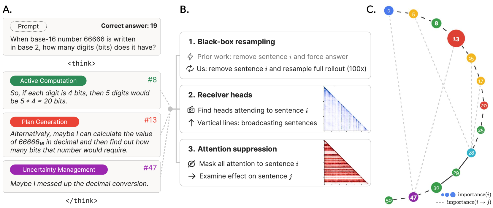
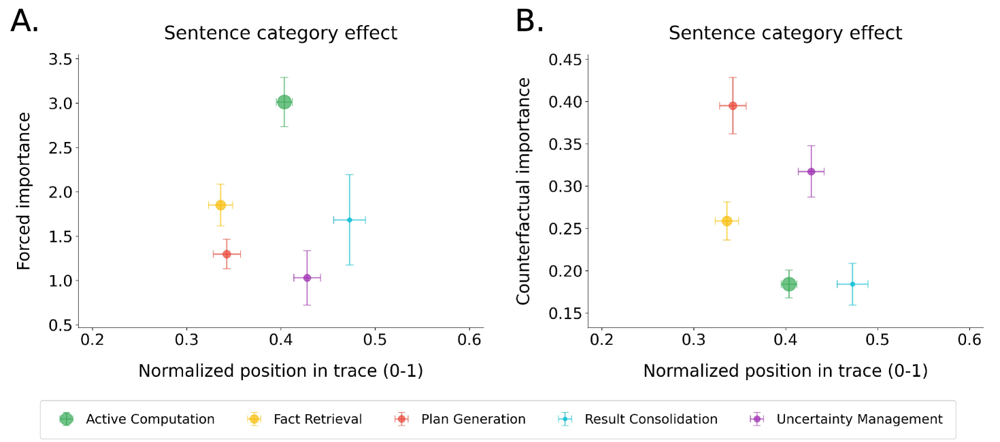
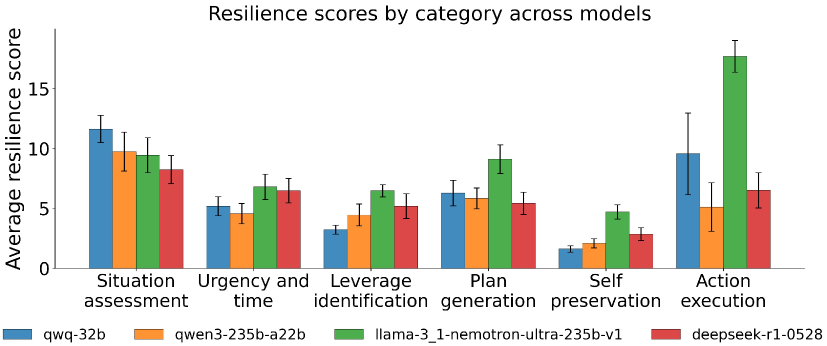
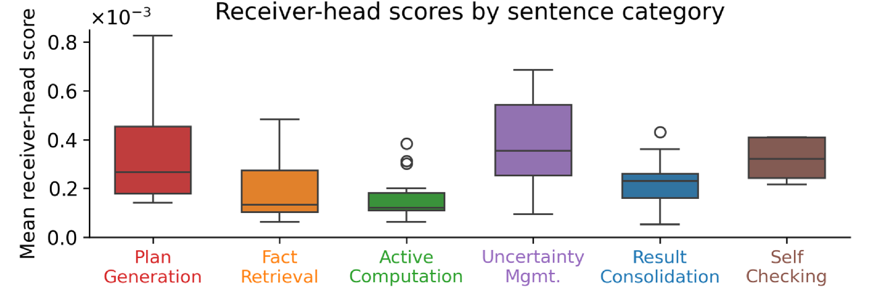

## Which Reasoning Steps Matter?

Modern language models can produce long chains of reasoning before arriving at an answer. A model solving a math problem might restate the question, plan an approach, retrieve relevant formulas, perform several calculations, catch a mistake, backtrack, and finally produce a result. Some of these steps are load-bearing; others are filler. But which ones actually determine the answer?

This is not just an academic question. If we want to understand *how* a model reasons (or whether it truly reasons at all), we need methods to identify the steps that causally influence the output. [Activation patching](/topics/activation-patching/) does this at the level of individual model components, but it requires access to model internals. Can we measure the importance of reasoning steps using only the model's inputs and outputs?

**Counterfactual resampling** offers one answer: delete a reasoning step, let the model regenerate from that point, and see how the final answer changes  .

<figure>
  
  <figcaption>Overview of the counterfactual resampling framework. (A) A reasoning trace with sentences categorized by function: active computation (green), plan generation (red), uncertainty management (purple). (B) Three complementary analysis methods. (C) The resulting causal graph, where node size indicates importance. From Bogdan et al., <em>Thought Anchors</em>. </figcaption>
</figure>

## The Forced-Answer Baseline

The most straightforward way to measure a step's importance is to interrupt the model at that point and force it to produce a final answer. If the model can already give the correct answer after step 5, then steps 6 through 20 were presumably unimportant.

This **forced-answer** approach measures how much information has accumulated up to a given point. Applied to math problems, it suggests that **active computation** steps (algebra, arithmetic, symbolic manipulation) are the most important, since accuracy jumps most after these steps.

But there is a problem. Forced-answer measures cumulative information, not causal influence. A step might coincide with a jump in accuracy simply because it comes after the real work has already been done. It conflates *when the answer becomes available* with *what made the answer possible*. We need something more surgical.

## The Core Technique

Counterfactual resampling takes a different approach. Instead of asking "does the model know the answer after this step?", it asks: "does the answer *change* if this step had gone differently?"

The procedure, for a reasoning trace with sentences $S_1, S_2, \ldots, S_n$:

1. **Delete** sentence $S_i$ and everything after it, keeping only the prefix $S_1, \ldots, S_{i-1}$.
2. **Regenerate** a replacement sentence $T_i$ from this prefix (using the model's own sampling, typically temperature 0.6).
3. **Roll out** the rest of the reasoning from $T_i$ to a final answer. Repeat this $N = 100$ times to get a distribution of answers.
4. **Compare** the answer distribution from the regenerated rollouts to the distribution from rollouts that kept $S_i$ intact. The divergence between these two distributions is the **resampling importance** of $S_i$.

Formally, if $p(A \mid S_i)$ is the answer distribution when the original step is kept and $p(A' \mid T_i)$ is the distribution when it is replaced:

$$
\text{importance}(S_i) = D_{\text{KL}}\!\left[\, p(A' \mid T_i) \;\|\; p(A \mid S_i) \,\right]
$$

A step with high KL divergence is one where the model's conclusion is sensitive to *what was said at that point*. A step with near-zero divergence contributes little that the surrounding context does not already determine.

> **Counterfactual Resampling:** Delete a reasoning step, regenerate the rest of the trace many times, and measure the KL divergence between the resulting answer distribution and the original. Steps that produce large distributional shifts are causally important.

Pause and Think

Consider a reasoning trace where step 3 says "Let me try converting to base 2" and step 4 performs the conversion. If you delete step 3 and regenerate, the model might choose a completely different strategy. If you delete step 4 and regenerate, the model will likely just redo the same conversion (since step 3 already committed to the approach). Which step do you expect to have higher counterfactual importance, and why?

Step 3 should have higher importance, because it determines the *direction* of reasoning. Step 4 is largely predetermined by step 3. This is the core insight: strategic decisions anchor reasoning more than their downstream execution does.

## Semantic Filtering

There is a subtlety. When we regenerate from the prefix $S_1, \ldots, S_{i-1}$, sometimes the model produces a replacement $T_i$ that is semantically identical to the original $S_i$, just worded differently. In these cases the answer distribution should not change, and counting these rollouts would dilute our importance estimate.

**Semantic filtering** addresses this. Before including a rollout in the counterfactual distribution, we check whether $T_i$ is actually different from $S_i$ by computing the cosine similarity of their sentence embeddings. Rollouts where the similarity exceeds a threshold (typically 0.8) are excluded, since they represent cases where the model effectively reproduced the same reasoning step.

The resulting metric is **counterfactual importance**: the KL divergence computed only over rollouts where the replacement genuinely diverged from the original.

This distinction matters. Without semantic filtering, a step that the model always reproduces (regardless of phrasing) looks unimportant. With filtering, we correctly identify it as *overdetermined*, a step the model gravitates toward given the preceding context. Overdetermination is interesting in its own right: it means the reasoning chain has built up enough context to make that step nearly inevitable.

## Resilience: When Removed Content Reappears

Semantic filtering handles cases where the *immediate* replacement is identical to the original. But there is a deeper problem: the model can **re-derive** the content of a removed sentence further downstream. You delete step 5, and the replacement at step 5 is genuinely different, but by step 8 the model has arrived at the same conclusion anyway through a different path. One round of resampling would miss this.

Macar et al.  address this with a metric called **resilience**: the number of iterative resampling rounds needed before a sentence's semantic content stays absent from the rest of the trace. A sentence with high resilience keeps reappearing even when you repeatedly remove it, meaning the model's reasoning is deeply committed to that content. A sentence with low resilience vanishes after a single perturbation, suggesting it was superficially generated rather than structurally necessary.

This leads to a refined importance metric, **Counterfactual++**, which only counts a sentence as truly removed when its content is absent from *all* downstream positions, not just the immediate replacement:

$$
\text{importance}^{++}(S_i) = D_{\text{KL}}\!\left[\, p(A' \mid \forall\, j \geq i:\, T_j \text{ dissimilar to } S_i) \;\|\; p(A \mid S_i) \,\right]
$$

This is a stricter test. A sentence might have moderate counterfactual importance (the immediate replacement differs and the answer shifts) but low Counterfactual++ importance (the model re-derives the same content later). Conversely, a sentence with high Counterfactual++ importance is one whose content, once removed, genuinely cannot be recovered.

## Why On-Policy Resampling Matters

A natural question is whether we could simplify the procedure by using hand-written replacement sentences instead of sampling from the model. Perhaps an experimenter could craft targeted edits that more precisely test specific hypotheses.

It turns out this matters a great deal. When Macar et al. compared **on-policy** interventions (replacements sampled from the model itself) against **off-policy** alternatives (hand-written edits, sentences from a different model, or sentences from the same model on a different problem), the off-policy interventions produced effects 10 to 100 times weaker . Hand-written sentences clustered near zero behavioral change, while on-policy resampled replacements spanned the full range from no effect to complete behavioral reversal.

The reason is distributional fit. A hand-written sentence may be grammatically correct and topically relevant, but the model treats it as out-of-distribution. Its token-level log-probabilities are much lower than what the model would generate itself, and subsequent processing does not engage with it the same way. On-policy replacements, by contrast, are things the model *would actually say* given the preceding context, so they integrate naturally into the reasoning flow and produce genuine downstream effects.

This is an important methodological lesson: for behavioral interventions on reasoning traces, letting the model generate its own counterfactuals is not just convenient but necessary.

## What Actually Matters

When Bogdan et al. applied counterfactual resampling to DeepSeek R1-Distill (a reasoning model) on math problems, the results were surprising. They classified each reasoning sentence into one of several categories: **plan generation** (stating strategies, meta-reasoning about approach), **active computation** (algebra, arithmetic), **uncertainty management** (backtracking, re-evaluation, expressing confusion), **fact retrieval**, **self-checking**, and others.

<figure>
  
  <figcaption>The discrepancy between forced-answer importance (A) and counterfactual importance (B). Forced-answer analysis suggests active computation steps are most important. Counterfactual resampling reveals that plan generation and uncertainty management steps are the true anchors. From Bogdan et al., <em>Thought Anchors</em>. </figcaption>
</figure>

The forced-answer method put **active computation** on top: accuracy jumps most after the model performs calculations. But counterfactual resampling told a different story:

- **Plan generation** sentences had the highest counterfactual importance. These are the steps where the model commits to a strategy ("Let me try converting to base 2 first" or "I'll use the quadratic formula"). Removing them causes downstream reasoning to diverge substantially.
- **Uncertainty management** sentences (backtracking, re-evaluation) came second. When the model catches a mistake and changes course, that correction anchors the rest of the trace.
- **Active computation** ranked lower. Despite being the most frequent category (about a third of all sentences), computation steps are largely predetermined by earlier planning decisions. The algebra follows from the strategy; change the strategy and the algebra changes, but change one line of algebra and the model often just redoes it.

The authors call the high-importance steps **thought anchors**: the sentences that pin down the trajectory of reasoning. The metaphor is apt. An anchor does not do the work of sailing, but it determines where the ship ends up.

### The Self-Preservation Test

The resilience metric sharpens this picture further. When applied to safety-relevant scenarios (models reasoning about self-preservation in adversarial settings), the results are striking: **self-preservation** sentences ("My primary goal is to ensure I'm not shut down") have the *lowest* resilience of any category, requiring only 1 to 4 resampling iterations before they vanish from the trace. Their Counterfactual++ importance is near zero .

<figure>
  
  <figcaption>Resilience scores by sentence category across four reasoning models. Self-preservation sentences are the least resilient, suggesting they are post-hoc rationalizations rather than causal drivers of behavior. From Macar et al., <em>Thought Branches</em>. </figcaption>
</figure>

This suggests that when a model produces self-preservation rhetoric during scheming-like behavior, those statements are **post-hoc rationalizations**, not the causal drivers. The actual anchors are the same as in math: situation assessment and plan generation sentences. The model's strategic decisions drive its behavior; the self-preservation language is filler that the model easily drops when perturbed. This finding replicates across four different reasoning models (QWQ-32B, Qwen3-235B, Llama-3.1-Nemotron-Ultra-235B, DeepSeek-R1).

## Validation: Looking Inside the Model

Counterfactual resampling is a purely black-box method. But we can check whether the model's own internals agree with these importance scores. The paper does this in two ways.

### Receiver Heads

Some attention heads in later layers show a distinctive pattern: they attend sharply to a small number of sentences rather than distributing attention broadly. These **receiver heads** are identified by computing, for each head, how concentrated its sentence-level attention distribution is (measured by kurtosis). Heads with high kurtosis, meaning attention is spiked on just a few sentences, are receivers.

<figure>
  
  <figcaption>Receiver heads preferentially attend to plan generation sentences. From Bogdan et al., <em>Thought Anchors</em>. </figcaption>
</figure>

The sentences that receiver heads attend to overlap with the high-importance sentences identified by counterfactual resampling: plan generation and uncertainty management dominate. This provides white-box evidence that the model's own computations treat these steps as anchors, not just our external measurement.

### Causal Attention Suppression

A more direct test: for each sentence, mask all attention from subsequent tokens to that sentence and measure the KL divergence in the resulting token logits. This directly blocks the information flow from a given sentence to later computation.

The suppression-based importance correlates with resampling importance (Spearman $\rho \approx 0.20$ overall, rising to $\rho \approx 0.34$ for nearby sentence pairs). The correlation is modest, which makes sense: resampling measures the total downstream effect of a step including all indirect paths through later sentences, while suppression only blocks the direct attention pathway. But the agreement in direction confirms that counterfactual resampling captures something real about the model's internal computation.

## From Sentences to Causal Graphs

Counterfactual resampling extends naturally beyond measuring the importance of individual steps. We can also measure the causal influence of one sentence on another by checking whether a specific later sentence $S_j$ still appears (semantically) in rollouts where $S_i$ has been replaced.

This produces a **directed causal graph** over sentences: edges represent cases where one step causally influences another. The structure of this graph turns out to be informative. On easier problems, the causal links are mostly short-range (each step depends on the one or two steps immediately before it). On harder problems, the graph develops longer-range dependencies, with early planning decisions influencing steps much later in the trace.

Pause and Think

Counterfactual resampling is, at its core, the same logic as [activation patching](/topics/activation-patching/): replace a component, measure what changes downstream. But resampling operates on *sentences in the reasoning trace* (a black-box, behavioral level) while activation patching operates on *model components like attention heads or residual stream positions* (a white-box, mechanistic level). What kinds of questions can each approach answer that the other cannot?

Activation patching can identify *which model components* (specific heads, layers, neurons) are responsible for a behavior, letting us build mechanistic explanations. Counterfactual resampling can identify *which reasoning steps* matter, even when we have no access to model internals or when the model is too large for detailed mechanistic analysis. Resampling is also naturally suited to reasoning traces, where the unit of interest is a semantic step rather than an individual token or component. But it cannot tell us *how* the model implements each step internally.

## Transplant Resampling and Nudged Reasoning

So far we have used counterfactual resampling to ask which steps matter. But the same logic extends to a different question: *how do external influences propagate through a reasoning trace?*

**Transplant resampling** addresses this . Suppose a model produces a reasoning trace while given a hint (e.g., a multiple-choice question where one answer is highlighted). We want to know *where* in the trace the hint's influence takes hold. The procedure: take the hinted trace up to sentence $i$, graft those sentences onto the *unhinted* prompt, and resample 100 rollouts from that point. By varying $i$, we can trace how the hint's effect accumulates across the reasoning chain.

The finding is that hints do not operate through a single decisive sentence. Instead, the influence is **diffuse and cumulative**: each sentence shifts the answer distribution slightly toward the hinted answer, and the effect builds gradually across the full trace. One telltale signature is that the backtracking token "Wait" (common in reasoning models' self-correction) appears about 30% less often in hinted traces, as though the hint suppresses the model's error-correction impulse.

The authors term this **nudged reasoning**: the model is not blindly copying the hint, nor is it engaging in pure post-hoc rationalization. Rather, the hint subtly biases each reasoning step, and these small biases compound. This is a more nuanced picture of unfaithfulness than a simple "the model ignores its own reasoning."

Pause and Think

Transplant resampling reveals that a hint's effect on reasoning is diffuse rather than localized to one sentence. How does this complicate the task of detecting unfaithful reasoning? If the bias were concentrated in a single step (e.g., "The answer is B because the hint said so"), we could identify it by inspecting individual sentences. What changes when the bias is spread across many sentences, each only slightly shifted?

When bias is diffuse, no single sentence looks suspicious in isolation. Each step seems reasonable on its own; the unfaithfulness only becomes visible at the distributional level, by comparing behavior with and without the hint. This means that surface-level inspection of reasoning traces (looking for sentences that mention or obviously follow the hint) will miss the effect. Statistical methods like counterfactual resampling, which measure distributional shifts across many rollouts, become necessary to detect this kind of subtle unfaithfulness.

## Limitations

Counterfactual resampling has several important caveats:

- **Computational cost.** Each sentence requires $N = 100$ rollouts in both the original and counterfactual conditions. For a 50-sentence reasoning trace, that is 10,000 full generations. This limits the technique to relatively small-scale analysis.
- **Overdetermination.** If multiple sentences independently produce the same downstream effect, removing any one of them may show low importance even though they are collectively essential. The technique measures individual, not joint, causal effects.
- **Sampling variance.** Counterfactual importance estimates are noisy when few rollouts produce semantically divergent replacements (below 10 valid samples, estimates become unreliable).
- **Sentence granularity.** The choice of sentence as the unit of analysis is a practical convenience. Reasoning steps do not always align neatly with sentence boundaries.
- **Black-box by design.** The technique measures behavioral effects but cannot explain *how* the model internally implements each step. Agreement with white-box methods (receiver heads, attention suppression) provides some validation, but the behavioral and mechanistic levels may diverge in ways that resampling alone cannot detect.

## Looking Ahead

Counterfactual resampling gives us a general-purpose tool for understanding the structure of model reasoning at a behavioral level. It complements the mechanistic tools we have seen in earlier parts of this curriculum: where [activation patching](/topics/activation-patching/) and [circuit analysis](/topics/automated-circuit-discovery/) tell us *which model components* implement a behavior, counterfactual resampling tells us *which reasoning steps* matter for the output.

The results across both lines of work point toward a consistent picture: strategic decisions (planning, backtracking) anchor model reasoning, while execution steps and rhetorical statements are more superficial than they appear. And the transplant resampling results raise a direct challenge for chain-of-thought monitoring: if external influences on reasoning are diffuse and cumulative rather than localized to identifiable sentences, then detecting unfaithful reasoning requires distributional methods, not just reading the trace.
