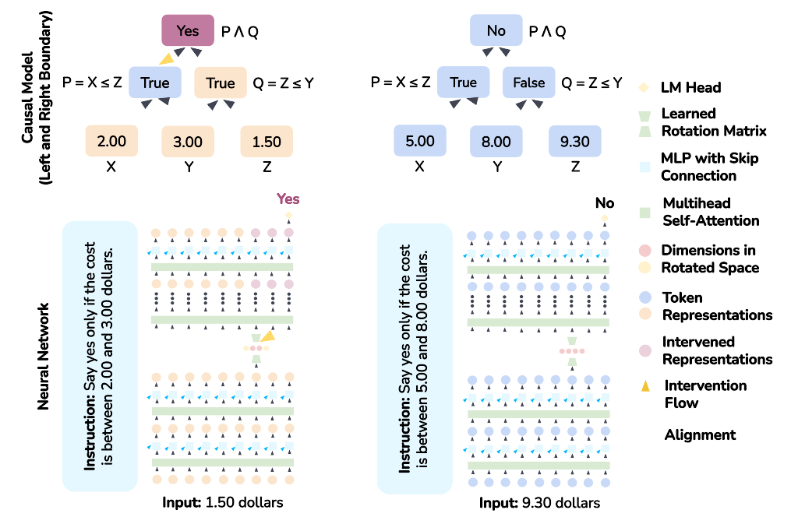

## What Ties MI Methods Together?

Over the preceding articles, we have built up a toolkit of causal intervention methods: [activation patching](/topics/activation-patching/) to localize where information lives, [attribution patching](/topics/attribution-patching/) to scale this up efficiently, and [refined methods](/topics/refined-attribution-methods/) to fix failure modes. Each technique replaces some internal component and measures what changes.

But we have not yet asked a more fundamental question: *what does it mean for a neural network to "implement" an interpretable algorithm?* When we say "this attention head computes the indirect object" or "this MLP layer stores factual associations," what exactly are we claiming, and how would we verify it?

**Causal abstraction** provides the answer. Developed by Geiger et al.  and later expanded into a comprehensive theoretical foundation , it formalizes the relationship between a high-level interpretable model (the kind of explanation we want) and the low-level neural network (the system we are trying to understand). The key insight: if we can *intervene* on aligned components of both systems and get matching results, then the high-level model faithfully describes the network's computation.

## Two Models, One Behavior

The setup has two ingredients:

1. **A high-level causal model** $\mathcal{H}$: a simple, interpretable description of how the task should be solved. For example, to check whether a price falls within a range, the high-level model might have two boolean variables: "above the lower bound?" and "below the upper bound?" The answer is "yes" if and only if both are true.

2. **A low-level neural network** $\mathcal{N}$: the actual model we want to understand. It takes the same inputs and produces the same outputs, but through millions of parameters and high-dimensional representations.

The question causal abstraction asks is: *does $\mathcal{N}$ implement $\mathcal{H}$?* Not just "do they agree on outputs" (that would be behavioral equivalence), but "do they agree on *internal structure*?" Are there components inside $\mathcal{N}$ that play the same causal roles as the variables in $\mathcal{H}$?

## Interchange Interventions

The test for causal alignment is the **interchange intervention**, which generalizes [activation patching](/topics/activation-patching/). The procedure:

1. Run the network on a **base input** $x_b$ (e.g., "Is $1.50 between $2.00 and $5.00?") and record its internal activations.
2. Run the network on a **source input** $x_s$ (e.g., "Is $3.50 between $2.00 and $5.00?") and record its activations.
3. **Swap** a specific internal representation from the source run into the base run. For instance, replace the activation at a particular layer and position.
4. Check: does the network's output after this swap match what the high-level model predicts?

In the example, the high-level model says the "above lower bound" variable should change from False (1.50 < 2.00) to True (3.50 > 2.00), flipping the final answer. If swapping the right neural representation also flips the network's answer, we have evidence that this representation implements the "above lower bound" variable.



> **Interchange Intervention:** Replace a neural network's internal representation at a specific location with the corresponding representation from a different input. If the output changes match what a high-level causal model predicts, the representation is *aligned* with the corresponding causal variable.

## Measuring Faithfulness with IIA

A single interchange intervention is one data point. To assess whether a high-level model faithfully describes the network, we need to test many pairs of inputs. **Interchange Intervention Accuracy (IIA)** is the proportion of these tests where the network's output matches the high-level model's prediction:

$$
\text{IIA} = \frac{1}{|\mathcal{P}|} \sum_{(x_b, x_s) \in \mathcal{P}} \mathbf{1}\!\left[\mathcal{N}^{\text{swap}}(x_b, x_s) = \mathcal{H}^{\text{swap}}(x_b, x_s)\right]
$$

where $\mathcal{P}$ is the set of input pairs and the superscript "swap" denotes the output after an interchange intervention on the aligned component.

An IIA of 100% means the high-level model is a perfect causal abstraction of the network at that location: every intervention produces matching behavior. Lower IIA indicates the abstraction is only approximate. This gives us a **graded** notion of faithfulness, rather than the binary "the model implements X or it doesn't."

Pause and Think

Consider a model that correctly answers "Is 3.50 between 2.00 and 5.00?" 85% of the time. What is the maximum IIA we could observe for *any* causal hypothesis about this model?

The maximum IIA is bounded by the model's task accuracy. If the model gets 15% of inputs wrong, those errors may not match any clean causal model's predictions. So 85% task accuracy caps IIA at roughly 85%. When Wu et al. applied Boundless DAS to Alpaca on a price-tagging task with ~85% accuracy, they observed 86-90% IIA for the best hypothesis, essentially matching the ceiling .

## Why Not Just Use Probes?

A natural reaction is: couldn't we just train a [probe](/topics/probing-classifiers/) to check whether a representation encodes the high-level variable? Probes test for *correlational* structure, interchange interventions test for *causal* structure, and the difference matters.

Geiger et al. construct an explicit example where a probe achieves perfect accuracy detecting a variable in a representation, yet interchange interventions show the representation plays no causal role in the computation . The information is *present* but not *used*. A probe cannot distinguish "the network stores X here and uses it downstream" from "the network stores X here as a byproduct but ignores it." Interchange interventions can, because they directly test whether changing the representation changes the output in the predicted way.

This is the same distinction between correlation and causation that motivates activation patching over observation-based methods. Causal abstraction formalizes it.

## Distributed Alignment Search

The framework so far requires us to specify *where* in the network to look for each high-level variable. For small models or well-understood tasks, hand-specified hypotheses work. But for larger models, we need to search.

**Distributed Alignment Search (DAS)** automates this . The idea: learn a rotation of the representation space such that specific subspaces become aligned with high-level causal variables. DAS optimizes an orthogonal rotation matrix $Q$ to maximize IIA across interchange interventions.

The key insight is that causal variables may not align with individual neurons. A concept like "above the lower bound" might be encoded as a direction in the high-dimensional activation space, distributed across many neurons. DAS finds these directions by learning the rotation that makes them axis-aligned, so they can be cleanly intervened on.

<figure>
  
  <figcaption>Distributed interchange interventions on Alpaca. The high-level causal model (top) has boolean variables; the neural network (bottom) processes inputs through layers of representations. DAS learns a rotation that aligns specific subspaces with the causal variables, enabling targeted interventions. From Wu et al., <em>Interpretability at Scale</em>. </figcaption>
</figure>

**Boundless DAS** extends this further by learning not just the rotation but also the *dimensionality* of each aligned subspace . Instead of fixing subspace sizes in advance, it uses learnable boundary parameters that automatically determine how many dimensions each causal variable needs. This reduces the search from $O(n \times m)$ (all possible dimension allocations) to $O(m)$ (one optimization per variable).

## Scaling to Large Models

Wu et al. applied Boundless DAS to Alpaca (a 7B parameter instruction-tuned LLaMA model) on a price-tagging task . They proposed four competing high-level causal models for how the model might solve "Is $X between $Y and $Z?":

- **Left and Right Boundary:** Two boolean variables (above lower bound? below upper bound?)
- **Mid-point Distance:** A continuous variable measuring distance from the range midpoint
- **Bracket Identity:** A categorical variable encoding which bracket the price falls in
- **Direct Comparison:** A single variable comparing price to both bounds simultaneously

<figure>
  
  <figcaption>The pipeline for applying causal abstraction at scale. From Wu et al., <em>Interpretability at Scale</em>. </figcaption>
</figure>

The Left and Right Boundary hypothesis achieved 86-90% IIA, while competing hypotheses reached only 70-72%. This provides positive evidence that Alpaca implements the intuitive two-check algorithm, with each boolean variable occupying about 5-10% of the representation space at specific layer-position pairs. The aligned representations transferred to unseen price brackets (94% accuracy) and were robust to irrelevant text prefixes (only 2% IIA drop).

## A Unifying Lens

The deepest contribution of the causal abstraction framework is conceptual: it shows that many MI methods are special cases of a single idea .

- **Activation patching** is an interchange intervention where the high-level model is implicit (we measure effect size rather than testing a specific prediction).
- **[Probing](/topics/probing-classifiers/)** tests whether information is *present* in a representation (a necessary but not sufficient condition for causal alignment).
- **Circuit analysis** searches for causal abstractions at the level of computational subgraphs.
- **[Sparse autoencoders](/topics/sparse-autoencoders/)** learn bijective transformations that make distributed features axis-aligned, a form of learned representation rotation.
- **[Concept erasure](/topics/concept-erasure/)** removes a causal variable's influence by projecting it out of the representation space.
- **[Steering](/topics/addition-steering/)** intervenes on a causal variable by adding a direction to the representation.

This does not mean these methods are interchangeable. Each makes different tradeoffs between automation and precision, and each is suited to different questions. But seeing them as instances of one framework clarifies what each method can and cannot tell us: they all test some form of alignment between human-interpretable variables and neural representations, differing in how they define the alignment and how they verify it.

Pause and Think

Activation patching (as we learned it) tells us that some component is *important* for a behavior. Interchange interventions tell us that some component *implements a specific variable*. What's the difference in practice? Consider an attention head that, when patched, changes the model's answer. What additional information would an interchange intervention give us?

Patching tells us the head matters but not *what it computes*. It could be computing the subject entity, the relation, the answer, or something we haven't thought of. An interchange intervention tests a specific hypothesis: "this head computes variable $X$." If swapping the head's output between inputs that differ only in $X$ produces the predicted output change, we have evidence for that specific function. If swapping produces unpredicted changes, the head's role is different from our hypothesis. Interchange interventions are more informative but require us to formulate the hypothesis first.

## Limitations

Causal abstraction is a powerful framework, but its practical application has real constraints:

- **Hypothesis-driven.** You must propose a high-level causal model before you can test it. The framework verifies or falsifies hypotheses; it does not discover them. For tasks without clear theoretical structure, formulating the right causal model is the bottleneck.
- **Computational cost.** Testing a causal model requires running many interchange interventions (quadratic in the number of input pairs). DAS adds gradient-based optimization on top. While feasible for 7B models on a single GPU, scaling further requires strategic selection of which positions and layers to test.
- **Linear subspace assumption.** DAS assumes causal variables are encoded in linear subspaces. This aligns with the [linear representation hypothesis](/topics/linear-representation-hypothesis/) and works well in practice, but representations that are genuinely nonlinear would be missed.
- **Task availability.** The framework works best on tasks where models perform well enough to test against. Wu et al. found that many reasoning tasks were too hard for 7B models to solve consistently, limiting the scope of analysis.
- **Approximate abstraction.** Real neural networks never perfectly implement clean causal models. IIA is always approximate, and the framework does not yet have strong conventions for what counts as "high enough" IIA to claim alignment.

## Looking Ahead

Causal abstraction gives us a principled language for the questions MI tries to answer. When we ask "does this model understand X?", the framework translates this into a testable claim: "is there a causal abstraction relating the model's representations to a causal model that computes X?" When we ask "is this circuit faithful?", it translates to: "does this subgraph achieve high IIA against the hypothesized algorithm?"

The framework has also crossed from theory into practice. DAS has been applied to analyze sentiment representation, syntax processing, and numerical reasoning in models up to 7B parameters. ReFT  operationalizes the same representation-intervention idea for fine-tuning, achieving 15-65x better parameter efficiency than LoRA by learning interventions on small subspaces rather than weight updates. The [pyvene](https://github.com/stanfordnlp/pyvene) library provides tooling for interchange interventions and DAS experiments.

As the reader continues through this curriculum, from [probing](/topics/probing-classifiers/) and [steering](/topics/addition-steering/) to [SAEs](/topics/sparse-autoencoders/) and [circuit analysis](/topics/circuit-tracing/), the causal abstraction framework provides the theoretical ground beneath all of them: each method is a way of asking whether some interpretable structure faithfully describes what a neural network computes.
