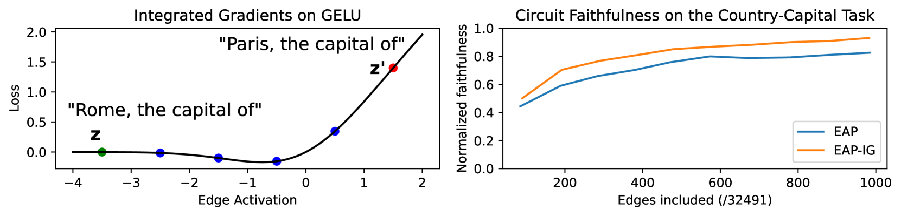
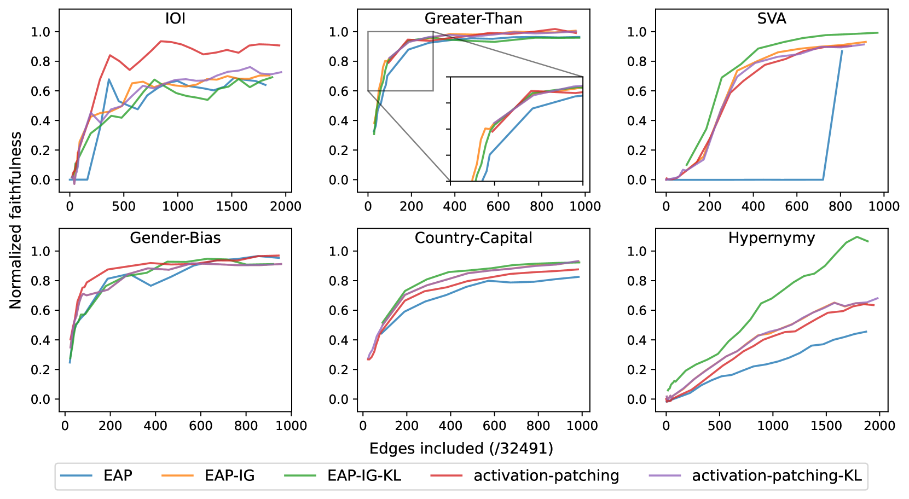

## When Gradients Mislead

[Attribution patching](/topics/attribution-patching/) approximates the effect of patching each component using a single gradient evaluation. This is fast (two forward passes plus one backward pass for all components) but relies on a linear approximation that can fail in specific, diagnosable ways.

These failures are not random noise. They are *systematic*, caused by specific nonlinearities in the transformer architecture. Understanding them matters because they produce **false negatives**: components or edges that are genuinely important but that gradient methods score as unimportant. A false positive (flagging an unimportant component) wastes time. A false negative (missing an important one) means the discovered circuit is wrong.

Three failure modes have been identified in the literature, each addressed by a different refinement.

## Failure Mode 1: Attention Saturation

The attention softmax maps logits to probabilities. In saturated regions, where one logit dominates, the probability is near 1 and its gradient is near 0. If the clean input puts the softmax in a saturated region, the gradient there is nearly flat, and the linear approximation estimates a near-zero patching effect even when the actual effect is large.

Consider an attention head that attends strongly (probability 0.99) to a specific token on the clean input but diffusely on the corrupted input. The true patching effect is large: replacing corrupted attention with clean attention would dramatically change where the head reads from. But the gradient at the clean attention pattern is nearly zero because the softmax is saturated. Attribution patching reports "this head does not matter," which is wrong.

Kramár et al. (2024) call this the **QK saturation problem** and show it is a primary source of false negatives in standard attribution patching .

## Failure Mode 2: Effect Cancellation

A component's total effect on the output is the sum of its **direct effect** (through its own output) and **indirect effects** (through how it influences downstream components). These can partially cancel: a head might have a positive direct effect and a negative indirect effect that nearly offset.

When the linear approximation introduces even small multiplicative errors in the indirect effect, the estimated total can become orders of magnitude smaller than the true total. If the true direct effect is +5 and the true indirect effect is -4.8, the true total is 0.2. But if the gradient approximation estimates the indirect effect as -5.1, the estimated total becomes -0.1, flipping the sign and halving the magnitude. Small relative errors in large, opposing terms produce large absolute errors in their sum.

Kramár et al. (2024) demonstrate this concretely: on MLP neurons in GPT-2 and Pythia-12B, cancellation produces false negatives where the true patching effect is 5-12 times larger than the attribution patching estimate .

## Failure Mode 3: Zero-Gradient Regions

When the corrupted input lands in a flat region of the loss landscape, the gradient at that point is near zero for all components. Standard attribution patching evaluates the gradient at the corrupted (or clean) input and multiplies by the activation difference. If the gradient is near zero, every component gets a near-zero score regardless of its actual importance.

This differs from saturation: saturation is specific to the softmax, while zero-gradient regions can arise anywhere in the loss landscape. A corrupted input that happens to produce a confident (but wrong) prediction will have small gradients because the model is not uncertain, just incorrect.

Hanna et al. (2024) identify this as the key failure mode for edge-level attribution .

Pause and think: Diagnosing failure modes

You run attribution patching on a circuit discovery task and find that it misses a head you know is important (from full activation patching). The head has high attention to a specific token (probability > 0.95) on the clean input. Which failure mode is most likely, and how would you confirm?

This is likely attention saturation. The softmax gradient is near zero at probability 0.95, so the attribution patching estimate will be near zero regardless of the true effect. You can confirm by checking the attention probabilities on clean versus corrupted inputs: if they differ substantially and the clean probabilities are near 0 or 1, saturation is the cause. AtP*'s QK fix (described below) would address this by recomputing the exact attention change rather than relying on the softmax gradient.

## AtP*: Fixing Node-Level Attribution

Kramár et al. (2024) introduce **AtP\*** (Attribution Patching, starred), which addresses saturation and cancellation with two targeted fixes while retaining scalability :

### The QK Fix

Instead of approximating the attention softmax with a gradient, AtP\* **recomputes it exactly**. For query and key nodes, AtP\* computes the actual attention weights under patching (using the corrupted query/key values) and the actual clean attention weights, then uses the *exact difference in attention patterns* as the perturbation for the rest of the gradient computation:

$$
\hat{\mathcal{I}}_{\text{AtP*}}^{Q}(n) = \left(\text{attn}(n)_\text{patch} - \text{attn}(n)(x^\text{clean})\right)^\top \frac{\partial \mathcal{L}}{\partial \text{attn}(n)}
$$

The gradient still approximates the effect of the attention change on downstream computation, but the attention change itself is computed exactly. This eliminates the saturation problem because we never linearize through the softmax.

The cost is modest: computing the patched attention patterns requires less than two additional forward passes, far cheaper than full activation patching over all components.

### GradDrop

To address cancellation, AtP\* uses **GradDrop**: compute the attribution estimate multiple times, each time zeroing out the gradient contribution from a different layer, then average the absolute values:

$$
\hat{c}_{\text{AtP*}}(n) = \frac{1}{L-1} \sum_{\ell=1}^{L} \left| \hat{\mathcal{I}}_{\text{GradDrop}_\ell}(n) \right|
$$

where $\hat{\mathcal{I}}_{\text{GradDrop}_\ell}$ is the attribution with the gradient at layer $\ell$ zeroed out.

The intuition: if direct and indirect effects cancel in the full computation, they are unlikely to cancel in the *same way* when individual gradient paths are dropped. Averaging absolute values across the dropout variants breaks the destructive interference. This requires $L$ additional backward passes (one per layer), but $L$ is much smaller than the number of components.

AtP\* also provides a method for **bounding remaining false negatives** using subset sampling with statistical tests, giving confidence intervals on how large any missed effect could be.

## EAP: Edge Attribution Patching

Before discussing EAP-IG, we need the baseline it improves on. **Edge Attribution Patching (EAP)** applies the gradient approximation to *edges* (connections between components) rather than nodes :

$$
\text{EAP}(u, v) = (\mathbf{z}_u^\text{corrupt} - \mathbf{z}_u^\text{clean})^\top \nabla_v \mathcal{L}
$$

where $u$ is the source node, $v$ is the destination node, $\mathbf{z}_u$ is the activation at node $u$, and $\nabla_v \mathcal{L}$ is the gradient of the metric with respect to the input at node $v$.

EAP scores every edge in the computational graph in a single forward-backward pass, making it dramatically more efficient than ACDC (which requires a forward pass per edge). Syed et al. showed that EAP outperforms ACDC on circuit recovery benchmarks while being orders of magnitude faster .

But EAP inherits the gradient approximation's failure modes. When the gradient at the evaluation point is near zero (failure mode 3), EAP assigns near-zero scores to all edges regardless of their true importance.

## EAP-IG: Integrated Gradients for Edges

Hanna et al. (2024) fix the zero-gradient problem by replacing the single gradient evaluation with **integrated gradients** along the path from corrupted to clean activations :

$$
\text{EAP-IG}(u, v) = (\mathbf{z}_u^\text{corrupt} - \mathbf{z}_u^\text{clean}) \cdot \frac{1}{m} \sum_{k=1}^{m} \nabla_v \mathcal{L}\!\left(\mathbf{z}^\text{corrupt} + \frac{k}{m}(\mathbf{z}^\text{clean} - \mathbf{z}^\text{corrupt})\right)
$$

Instead of evaluating the gradient at a single point, EAP-IG evaluates it at $m$ equally-spaced points along the straight line from corrupted to clean activations and averages.

<figure>
  
  <figcaption>Left: integrated gradients on a GELU activation. EAP evaluates the gradient at a single point (blue, in a flat region), missing the edge's importance. EAP-IG samples at intermediate points (colored dots) that capture the steep transition. Right: this translates to more faithful circuits on the Country-Capital task. From Hanna et al., <em>Have Faith in Faithfulness</em>. </figcaption>
</figure>

If the corrupted point sits in a flat region, some of the interpolation points will be in regions with informative gradients. The average captures the cumulative effect across the full path, not just the local slope at one endpoint. In practice, $m = 5$ integration steps are sufficient for stable results.

### Faithfulness over Overlap

The key finding from Hanna et al. is methodological: they show that **circuit overlap** (how many nodes match a ground-truth circuit) is a misleading evaluation metric. EAP and EAP-IG produce circuits with similar node overlap to ground-truth circuits, but EAP circuits are significantly **less faithful** (they reproduce less of the model's behavior when isolated).

> Overlap tells you whether you found the right components. Faithfulness tells you whether the circuit actually *works*.

EAP-IG consistently produces more faithful circuits across six benchmark tasks on GPT-2 Small. On the Subject-Verb Agreement task, EAP produced completely unfaithful circuits until over 1,000 edges were included, while EAP-IG maintained faithfulness throughout .

<figure>
  
  <figcaption>Circuit faithfulness across six benchmark tasks on GPT-2 Small. EAP-IG circuits (orange) consistently match or exceed the faithfulness of EAP circuits (blue), often reaching high faithfulness with far fewer edges. The difference is most striking on SVA (top right), where EAP circuits remain near zero faithfulness until a large fraction of edges are included. From Hanna et al., <em>Have Faith in Faithfulness</em>. </figcaption>
</figure>

Pause and think: Why integrated gradients help

Consider a loss landscape shaped like a step function, flat on both sides but with a steep transition in the middle. The corrupted input is on one flat side, the clean input is on the other. What does EAP report? What does EAP-IG report?

EAP evaluates the gradient at the corrupted input, which is on the flat side: gradient near zero, so the attribution is near zero. EAP-IG evaluates gradients at 5 points along the path. Some of those points fall in the steep transition region, where the gradient is large. The average captures this transition, producing a non-zero attribution that correctly reflects the edge's importance. This is exactly the zero-gradient failure mode that EAP-IG was designed to address.

## EAP-GP: Adaptive Paths

EAP-IG integrates along a **straight line** from corrupted to clean activations. Zhang et al. (2025) identify a remaining problem: if the straight-line path passes through a **saturation region** (where gradients are persistently near zero over a broad area, not just at the endpoints), even averaging over the path produces dampened scores .

**EAP-GP** (Edge Attribution Patching with GradPath) replaces the straight-line path with an **adaptive path** that follows the direction of informative gradients:

Starting from the corrupted input, EAP-GP steps in the direction of the difference between the corrupted and clean gradients, actively steering the integration path away from saturated regions where the attribution signal is weak. The adaptive path reaches the clean input by a different route than the straight line, one that traverses regions with higher gradient sensitivity.

On GPT-2 variants (Small, Medium, XL) across six circuit discovery benchmarks, EAP-GP improved circuit faithfulness by up to 17.7% over EAP-IG, with precision and recall matching or exceeding prior methods when validated against manually annotated ground-truth circuits .

## Choosing a Method

Each refinement targets a specific failure mode and adds computational cost:

| Method | Targets | Cost | Scope |
|--------|---------|------|-------|
| **AtP** | (baseline) | 2 fwd + 1 bwd | Nodes |
| **AtP\*** (QK fix) | Attention saturation | + ~2 fwd | Nodes |
| **AtP\*** (GradDrop) | Cancellation | + $L$ bwd | Nodes |
| **EAP** | (baseline) | 2 fwd + 1 bwd | Edges |
| **EAP-IG** | Zero-gradient regions | $m$ fwd + $m$ bwd | Edges |
| **EAP-GP** | Saturation along path | $m$ fwd + $m$ bwd | Edges |

The methods are complementary rather than competing. AtP\* and EAP-IG operate at different granularities (nodes vs. edges) and address different failure modes. A thorough circuit discovery workflow might use AtP\* for node-level screening and EAP-IG or EAP-GP for edge-level circuit extraction.

The practical recommendation is the same as for basic attribution patching: use gradient methods for fast screening, then verify the most important results with full [activation patching](/topics/activation-patching/). The refinements reduce false negatives, making the screening more reliable, but they do not eliminate the need for causal verification on the components that matter most.

## Looking Forward

The progression from AtP to AtP\* to EAP-IG to EAP-GP illustrates a recurring pattern in mechanistic interpretability: a simple, scalable method is introduced, its failure modes are characterized, and targeted fixes are developed. Each refinement narrows the gap between the fast approximation and the gold-standard causal experiment.

These improved attribution methods feed directly into automated circuit discovery. More faithful edge attributions mean more accurate circuits, which in turn enable more reliable mechanistic claims about how models compute their outputs. For the most complete circuit analysis ever performed using these tools, see [the IOI circuit](/topics/ioi-circuit/).
