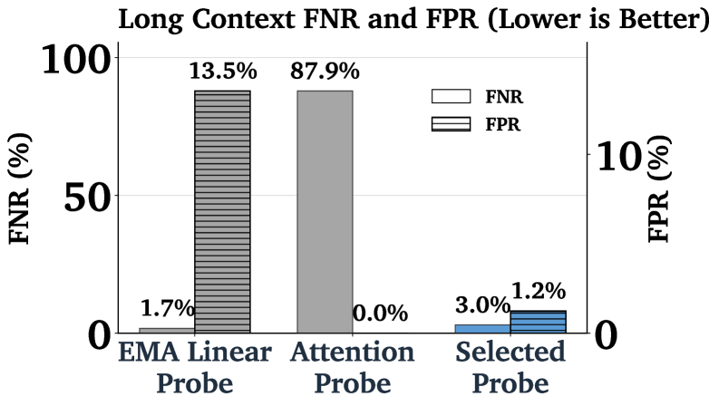
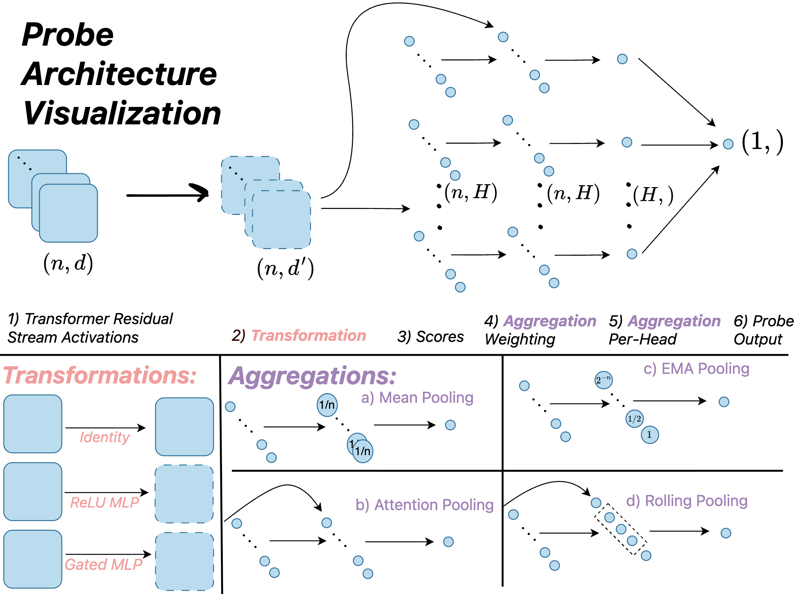
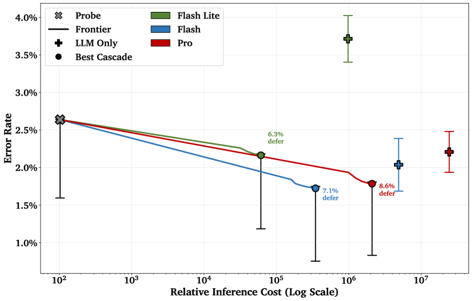

## From the Lab to the Real World

[Probing classifiers](/topics/probing-classifiers/) and [attention probes](/topics/attention-probes/) work well in controlled research settings: clean datasets, fixed sequence lengths, no adversarial pressure. But deploying probes as part of a production safety system introduces challenges that research evaluations rarely address.

Consider the gap. A research probe is trained on a curated dataset of a few thousand examples, tested on a held-out split from the same distribution, and evaluated on balanced accuracy. A production probe must handle millions of requests per day, with sequence lengths ranging from a single sentence to hundreds of thousands of tokens, under active adversarial attack from users trying to circumvent safety filters, while maintaining false positive rates low enough that legitimate users are almost never affected.

Two recent efforts have pushed probes into this production regime. Cunningham et al. (2025) deployed linear probes as part of Anthropic's jailbreak detection system, ensembled with external classifiers in a cascade architecture . Kramár et al. (2026) developed novel probe architectures for Google's Gemini that handle long-context distribution shifts and cascade with LLM classifiers . Together, these efforts reveal a set of recurring challenges and architectural patterns for deploying probes at scale.

## The Distribution Shift Problem

The most serious failure mode for production probes is distribution shift: the probe encounters inputs at deployment time that differ systematically from its training data. The biggest culprit is sequence length.

Research probes are typically trained on short sequences (a few hundred tokens). Production traffic includes long documents, multi-turn conversations, and adversarial inputs that deliberately pad context to confuse classifiers. When Kramár et al. tested a standard [attention probe](/topics/attention-probes/) trained on short-context data against long-context attacks, the false negative rate was **87.9%** . The probe missed nearly nine out of ten attacks. The same probe performed well on short inputs from the same distribution as its training data.

Why does length break probes? Recall from the [attention probes](/topics/attention-probes/) article that probes must aggregate per-token hidden states into a single representation for classification. Standard attention probes compute a softmax-weighted average over all token positions. As the sequence grows, the harmful signal (which may be concentrated in a small number of tokens) gets diluted by the representations of thousands of benign tokens. The softmax distributes weight too evenly, and the signal drowns.

Multi-turn conversations create a related problem. A harmful request may be fragmented across multiple conversational turns, each individually benign. The probe needs to integrate information across turns, but each turn is processed with a growing context window where earlier content is increasingly diluted.

Training on long-context data is the obvious fix, but it is expensive: Kramár et al. found that training directly on long-context examples increased training cost by **22x** due to memory bandwidth constraints . The better approach is to design architectures that generalize to long contexts even when trained on short ones.

<figure>
  
  <figcaption>Long-context performance of different probe architectures. The standard attention probe misses 87.9% of long-context attacks, while architectures designed for variable-length inputs reduce the false negative rate to low single digits. From Kramár et al., <em>Building Production-Ready Probes for Gemini</em>. </figcaption>
</figure>

## Aggregation Architectures That Scale

The core architectural question for production probes is: *how do we aggregate per-token signals into a sequence-level prediction without diluting localized signals?*

<figure>
  
  <figcaption>Unified framework for probe architectures, showing how different aggregation methods (mean pooling, attention, EMA, rolling) slot into the same pipeline. The key architectural choice is the aggregation step, which determines how per-token scores are combined into a single sequence-level prediction. From Kramár et al., <em>Building Production-Ready Probes for Gemini</em>. </figcaption>
</figure>

### MultiMax

The MultiMax architecture replaces the softmax-weighted average of standard attention probes with a hard maximum . Instead of computing a weighted sum over all token positions, each attention head selects the single highest-scoring token:

$$
f_\text{MultiMax}(S) = \sum_{h=1}^{H} \max_{j \in [n]} \left[ \mathbf{v}_h^\top \mathbf{y}_j \right]
$$

where $H$ is the number of heads, $\mathbf{v}_h$ is the value vector for head $h$, and $\mathbf{y}_j$ is the MLP-transformed activation at position $j$.

The intuition is straightforward: if harmful content appears in even a small portion of a long sequence, the max operation ensures that the strongest signal is preserved rather than averaged away. This directly addresses the dilution problem. With multiple heads, the probe can attend to several suspicious positions simultaneously.

### Max of Rolling Means Attention

A second architecture combines sliding windows with attention . Within each window of $w$ consecutive tokens (defaulting to $w = 10$), attention-weighted averages are computed:

$$
\bar{\mathbf{v}}_t = \frac{\sum_{j=t-w+1}^{t} \alpha_j \cdot \mathbf{v}_j}{\sum_{j=t-w+1}^{t} \alpha_j}
$$

The final score is the maximum across all window positions: $\max_t(\bar{\mathbf{v}}_t)$.

This strikes a middle ground: local averaging within windows preserves context (a few adjacent tokens together may signal harm more clearly than any single token), while the max operation across windows prevents dilution across the full sequence.

### Results on Long-Context Attacks

The impact of architecture choice is dramatic. On long-context adversarial attacks :

| Architecture | FNR (long-context attacks) |
|---|---|
| Standard Attention | 87.9% |
| Max of Rolling Means Attention | 3.0% |
| MultiMax Aggregation | 1.7% |

The baseline attention probe misses almost everything. The improved architectures catch nearly everything, despite being trained on the same short-context data. Architecture choice alone produces a roughly 50-fold improvement in false negative rate on this distribution shift.

Pause and think: Why hard max?

Standard attention probes use softmax to compute a weighted average over positions. MultiMax uses a hard max instead. What are the tradeoffs? When would you expect softmax attention to outperform hard max, and vice versa?

When harmful content is concentrated in a few tokens within a long sequence, hard max preserves the signal while softmax dilutes it across all positions. But when the signal is genuinely distributed across many tokens (for example, an overall sentiment), softmax aggregation captures the collective signal more accurately. Hard max would select only the single most extreme position, potentially missing the broader pattern. In short: hard max excels at detecting localized, high-intensity signals in long sequences, while softmax excels at aggregating diffuse signals. Production safety probes typically look for localized harmful content, making hard max the better default.

## Sliding Window Mean (SWiM) Logit Smoothing

Cunningham et al. (2025) introduced a complementary technique for stabilizing probe predictions over time . Rather than redesigning the aggregation architecture, SWiM smooths the probe's per-token logits by averaging over a sliding window of $M$ tokens:

$$
\bar{z}_t = \frac{1}{M} \sum_{i=t-M+1}^{t} z_i
$$

With $M = 16$, this simple post-processing reduces false positives from isolated activation spikes. A single token that happens to activate strongly does not trigger a detection; instead, the probe requires sustained activation over a window of tokens. This is particularly useful during generation, where the probe monitors each token as the model produces it.

## Cascade Architectures

Even with improved architectures, probes face a fundamental accuracy ceiling: they read only from frozen activations using a simple classifier. LLM-based classifiers (where a separate language model evaluates whether content is harmful) are more accurate but orders of magnitude more expensive. Probes cost roughly **377K FLOPs per token** (for a multi-layer linear probe on a 27B-parameter model), while even a small external classifier requires billions of FLOPs per forward pass .

The cascade architecture resolves this tradeoff: use the cheap probe to screen all traffic, and escalate only uncertain cases to the expensive classifier.

> **Cascade Classifier:** A two-stage deployment architecture where a cheap classifier (the probe) handles the majority of traffic, and only cases where the probe's confidence falls between two thresholds $\tau_1$ and $\tau_2$ are escalated to an expensive classifier (typically an LLM). Cases below $\tau_1$ are classified as safe; cases above $\tau_2$ are classified as harmful; the uncertain middle band is deferred.

Both teams deployed this pattern:

- **Anthropic's cascade** routes approximately 5.5% of production traffic to a second-stage classifier, achieving a 5.4x computational cost reduction compared to running the expensive classifier on everything .
- **Google's cascade** defers about 8% of traffic to a Gemini LLM classifier, achieving accuracy better than the LLM alone at roughly 1/50th the inference cost .

The cascade works because most traffic is easy. The vast majority of requests are clearly benign, and a linear probe is sufficient to confidently classify them. Only the ambiguous cases (borderline requests, sophisticated attacks, unusual phrasings) require the expensive classifier's deeper reasoning.

<figure>
  
  <figcaption>Cost-error Pareto frontier for cascading probes with LLM classifiers. By deferring only 6-9% of traffic to an LLM, cascade systems achieve lower error rates than either the probe or the LLM alone, at a fraction of the standalone LLM cost. From Kramár et al., <em>Building Production-Ready Probes for Gemini</em>. </figcaption>
</figure>

Pause and think: Threshold selection

A cascade classifier uses two thresholds: $\tau_1$ (below which the probe classifies as safe) and $\tau_2$ (above which the probe classifies as harmful). Cases between the thresholds are escalated to a more expensive classifier. How would you choose these thresholds? What happens if you set them too close together? Too far apart?

If the thresholds are too close together (narrow uncertain band), most traffic is handled by the probe alone. This is cheap, but the probe makes more final decisions on borderline cases, increasing both false positives and false negatives. If the thresholds are too far apart (wide uncertain band), more traffic is escalated, which is more accurate but increases cost and may approach the expense of running the full classifier on everything. The optimal thresholds depend on the cost ratio between the probe and the expensive classifier, and on the cost of false positives versus false negatives. In safety-critical systems where false negatives (missed harmful content) are very costly, you would widen the uncertain band to escalate more aggressively.

## Ensembling Probes with LLM Classifiers

Beyond cascading, probes and LLM classifiers provide genuinely complementary signals. Cunningham et al. found that the Spearman rank correlation between probe scores and small classifier scores was lower than the correlation between pairs of external classifiers . This means probes and classifiers disagree in different places, making their ensemble stronger than an ensemble of classifiers alone.

The production system combines probe and classifier logits with a simple weighted average:

$$
z_\text{final} = \alpha \cdot z_\text{probe} + (1 - \alpha) \cdot z_\text{classifier}
$$

with $\alpha \approx 0.55$ in practice. Near-equal weighting proves optimal, reflecting the roughly comparable signal quality from both sources .

Why do probes and classifiers complement each other? They read different signals. The probe operates directly on the model's internal activations, detecting patterns in how the model *represents* content. The LLM classifier evaluates the content *semantically*, reasoning about meaning. An adversarial input that fools the classifier's semantic reasoning may still produce distinctive activation patterns visible to the probe, and vice versa.

## Training for Robustness

Architecture alone is not enough. Both teams found that training strategy is equally important for production robustness.

**Diverse training distributions.** Kramár et al. trained on a mixture of short-context attacks, overtriggering examples (benign inputs that look suspicious), and multi-turn attacks, intentionally excluding long-context data from training to test architectural generalization . Their total training set was just 3,175 examples, far smaller than typical ML datasets, but carefully curated across diverse attack types.

**Multi-layer activation concatenation.** Rather than probing a single layer, both teams concatenated activations across multiple (or all) layers. Cunningham et al. used all 46 layers of Gemma 3 27B, finding that multi-layer probes substantially outperform single-layer variants . This makes sense: different layers encode different aspects of content, and harmful intent may be most salient at different layers for different attack types.

**Softmax-weighted loss.** Standard training treats all token positions equally. Cunningham et al. introduced a loss function that weights each token's contribution by the probe's confidence at that position:

$$
w_t = \frac{\exp(\bar{z}_t / \tau)}{\sum_{t'} \exp(\bar{z}_{t'} / \tau)}
$$

with temperature $\tau = 1$. This focuses learning on the tokens where the probe is most confident about harmful content, allowing the probe to correctly predict harmlessness for benign prefixes without penalty . A harmful response only becomes harmful partway through generation; the loss function lets the probe learn *when* the harmful content starts.

## What Production Numbers Look Like

The concrete results from deployed systems give a sense of what production-grade probe performance means:

**Cost:** Probes achieve a **40x** computational cost reduction compared to running a full exchange classifier on every request . In absolute terms, a multi-layer linear probe costs roughly 377K FLOPs per token versus 8B FLOPs for a single forward pass of even a small external classifier. Probes run at over **10,000x lower cost** than LLM-based classifiers .

**False positive rate:** The production system at Anthropic maintains a **0.05% refusal rate** on production traffic, down from 0.38% in the previous generation . This means roughly 1 in 2,000 legitimate requests is incorrectly flagged.

**Adversarial robustness:** The system underwent **1,736 cumulative hours of human red-teaming** across approximately 198,000 adversarial attempts. The result: only one high-risk vulnerability was discovered, and no universal jailbreak successfully elicited harmful responses across all target queries. The minimum time to discover the first vulnerability was 30 hours of dedicated adversarial effort .

**Cascade efficiency:** Google's probe-plus-LLM cascade achieves higher accuracy than either component alone, while using roughly 1/50th the inference cost of the LLM classifier .

## Implications for Mechanistic Interpretability

Production probe deployment is one of the clearest cases where mechanistic interpretability techniques deliver direct practical value. The probes work because of the [linear representation hypothesis](/topics/linear-representation-hypothesis/): if safety-relevant properties are encoded as linear directions in activation space, then linear probes can detect them cheaply and reliably.

But production deployment also highlights limitations. The probes are correlational tools, just as the [probing classifiers](/topics/probing-classifiers/) article discussed. They detect activation patterns associated with harmful content, not harmful intent per se. An input that produces unusual activations for other reasons (a highly creative prompt, an unusual language, an edge case the probe has not seen) can trigger false positives. This is why cascade architectures escalate uncertain cases to classifiers with deeper reasoning ability rather than relying on probes alone.

The distribution shift problem is also a reminder that [probe accuracy on a test set does not tell the whole story](/topics/probing-classifiers/). A probe that achieves 99% accuracy on short, clean evaluation data can fail catastrophically on the long, messy, adversarial inputs that characterize real-world deployment. Architecture and training choices that seem minor in a research context (hard max vs. softmax, sliding window size, loss weighting) become load-bearing in production.

## Looking Forward

Probes in production represent one path from interpretability research to deployed safety infrastructure. The [attention probes](/topics/attention-probes/) that began as research tools for understanding what information is accessible in activations are now screening millions of requests per day.

The techniques covered here (cascade architectures, robust aggregation, probe-classifier ensembling) are specific to the deployment setting, but they build directly on the probing foundations covered earlier in this block. The fundamental insight remains the same: model activations encode rich, linearly accessible information about the content they process, and simple classifiers can read it.

What production experience adds is the engineering discipline needed to make that insight reliable: handling distribution shifts, managing false positive rates at scale, and combining probes with other tools in systems that are more robust than any single component.
