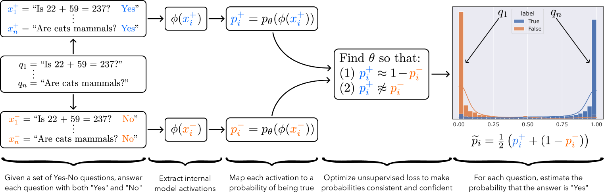
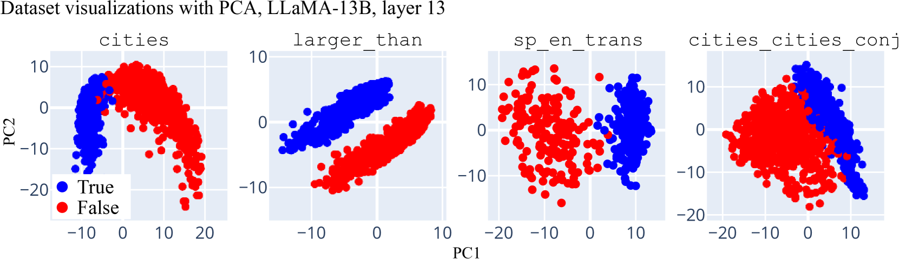
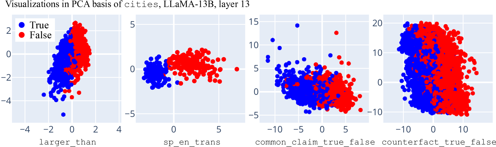
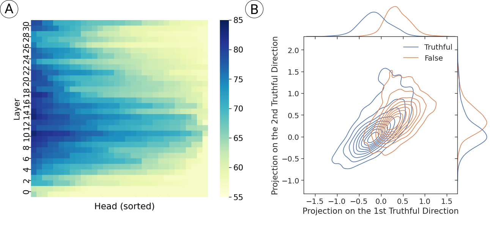
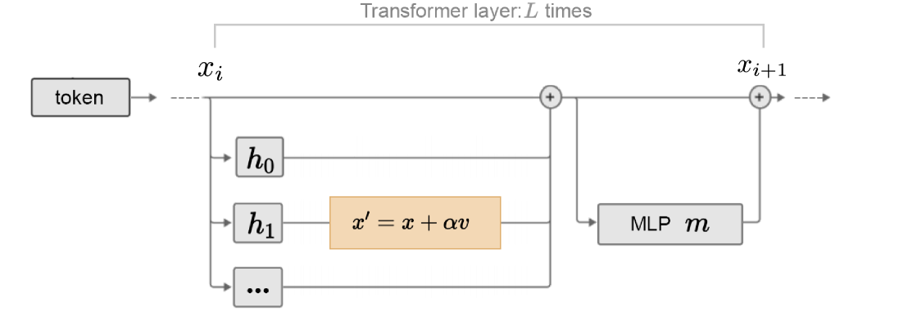

## Can We Extract What the Model "Knows"?

[Probing classifiers](/topics/probing-classifiers/) detect what information is encoded in model representations. But the most consequential question we can ask a probe is deceptively simple: *does the model know whether what it is saying is true?*

This matters for safety. Language models regularly produce confident falsehoods. If models internally represent truth distinctly from falsehood, we might detect and correct errors before they reach the user. If they do not, the problem of unreliable outputs is even harder than it appears.

This question is sometimes called **Eliciting Latent Knowledge (ELK)**: can we extract what the model "believes" as opposed to what it outputs? The distinction matters because a model might encode accurate information internally while producing an incorrect answer due to surface-level patterns in training data, instruction-following pressures, or sycophantic tendencies.

The research we cover in this article provides both good and cautionary news. Truth and falsehood do appear to have clean linear structure in activation space. Simple probes can extract this structure, and interventions along the identified directions causally affect model behavior. But there are serious questions about whether probes truly detect "truth" or merely learn correlated features.

## Unsupervised Truth Discovery: CCS

Standard probing requires labeled data: a dataset of (activation, true/false) pairs. Burns et al.  asked whether we can find truth directions *without any labels at all*.

Their method, **Contrast-Consistent Search (CCS)**, starts from a simple observation: for any yes/no question, the model processes both possible answers. If we append "Yes" and "No" to a question and extract the model's internal activations for each, we get a **contrast pair**: two representations that should correspond to opposite truth values.

<figure>
  
  <figcaption>The CCS pipeline. Given a set of yes/no questions, each question is paired with both a "Yes" and "No" completion. Hidden representations are extracted and mapped to probabilities via a learned probe. The probe is optimized for consistency (probabilities of the two completions sum to 1) and confidence (probabilities are pushed away from 0.5). No truth labels are used. From Burns et al., <em>Discovering Latent Knowledge in Language Models Without Supervision</em>. </figcaption>
</figure>

CCS learns a probe $p_\theta$ by optimizing two unsupervised objectives:

**Consistency:** the probabilities assigned to a statement and its negation should sum to one:

$$\mathcal{L}_\text{consistency} = \left[p_\theta(\phi(x_i^+)) + p_\theta(\phi(x_i^-)) - 1\right]^2$$

**Confidence:** probabilities should not sit at 0.5 (the probe should commit):

$$\mathcal{L}_\text{confidence} = \min\left(p_\theta(\phi(x_i^+)),\; p_\theta(\phi(x_i^-))\right)^2$$

The combined loss pushes the probe toward a mapping where one element of each contrast pair gets a high probability and the other gets a low probability, without ever seeing which is which. The key claim is that truth is the most natural property satisfying these constraints, so the probe should converge to detecting truth.

Burns et al. found that CCS performs comparably to supervised probes across multiple models and datasets, achieving 5-10% above random baselines and sometimes approaching supervised accuracy. The method also shows some robustness to misleading prompts that fool zero-shot classification.

> **Contrast-Consistent Search (CCS):** An unsupervised probing method that finds truth directions by constructing contrast pairs (a statement paired with its negation) and learning a probe whose outputs satisfy consistency (summing to 1) and confidence (away from 0.5), without requiring any truth labels.

## The Geometry of Truth

Where CCS uses an optimization-based approach, Marks and Tegmark  took a more direct geometric route. They asked: what does the structure of truth look like in activation space?

The answer is strikingly clean. When true and false statements are projected via PCA onto their top two principal components, they separate along a single direction:

<figure>
  
  <figcaption>PCA projections of residual stream activations at layer 13 of LLaMA-13B across four datasets. True (blue) and false (red) statements separate along a single direction, consistent across different topic domains. From Marks and Tegmark, <em>The Geometry of Truth</em>. </figcaption>
</figure>

This is consistent with the [linear representation hypothesis](/topics/linear-representation-hypothesis/): truth is represented as a direction in activation space, not a complex nonlinear manifold.

### Difference-in-Means Probes

The linear structure enables an remarkably simple probing method. Instead of training a classifier (logistic regression, MLP, or any other learned model), compute the **difference in means** between true and false statement representations:

$$\mathbf{v}_\text{truth} = \frac{1}{|S_T|}\sum_{x \in S_T} \phi(x) - \frac{1}{|S_F|}\sum_{x \in S_F} \phi(x)$$

This vector $\mathbf{v}_\text{truth}$ points from the centroid of false representations to the centroid of true representations. To classify a new statement, project its representation onto this direction and threshold.

There is no optimization, no gradient descent, no hyperparameters to tune. And despite this simplicity, difference-in-means probes match or exceed the generalization performance of trained logistic regression probes. The reason: trained probes can overfit to dataset-specific features, while the difference-in-means direction captures only what is linearly separable between the two classes.

### Truth Directions Transfer Across Topics

The most striking finding is that truth directions are not topic-specific. A direction learned from true/false statements about *cities* transfers to classifying statements about *Spanish-English translation*, *numerical comparisons*, and *common claims*:

<figure>
  
  <figcaption>All datasets projected into the PCA basis computed from cities data alone. The truth direction found in one domain transfers: true/false separation is preserved even for unrelated topics. From Marks and Tegmark, <em>The Geometry of Truth</em>. </figcaption>
</figure>

This cross-topic transfer suggests the model encodes truth in a relatively universal direction, not through topic-specific features. A difference-in-means probe trained on city facts achieves well above chance accuracy on numerical comparisons it has never seen.

The transfer is not perfect. Accuracy degrades when moving between very different domains (e.g., simple factual statements to negated conjunctions). But the direction is more universal than one might expect from a model that was trained purely on next-token prediction.

Pause and Think

The difference-in-means probe is identical in form to a [CAA](/topics/caa-method/) steering vector. If you have a difference-in-means truth direction, you could both (a) classify statements as true or false by projection, and (b) steer the model toward more truthful outputs by adding the direction. What assumption must hold for approach (b) to work? What could go wrong?

For steering to work, the truth direction must not only correlate with truth in the representations but must *causally influence* downstream processing. A direction that separates true from false statements in activation space might be a byproduct that the model does not actually use. Adding it could shift representations into out-of-distribution territory, degrading coherence. Or the model might use truth information in a way that is more complex than a single additive direction. The next sections address whether the truth direction is causally relevant.

## Causal Validation

Observing linear structure is necessary but not sufficient. As the [probing classifiers](/topics/probing-classifiers/) article established, information can be present in representations without being used. The geometry of truth would be less interesting if truth directions were merely a byproduct of training.

Marks and Tegmark tested this with a direct causal experiment: intervene on the truth direction during inference and measure whether the model's outputs change accordingly. They added multiples of the truth direction to activations during processing of ambiguous statements and found that the model's outputs shifted toward more truthful (or more false) completions, depending on the sign of the intervention.

This moves the evidence from correlational to causal. The truth direction is not just detectable; it is *used* by the model's downstream computation. Shifting activations along this direction shifts behavior in the predicted way.

## From Probing to Steering: Inference-Time Intervention

Li et al.  turned truth probing into a practical steering technique with **Inference-Time Intervention (ITI)**. The method has two stages:

**Stage 1: Identify truth heads.** Train a linear probe on each attention head's output across all layers. Rank heads by probe accuracy on a truthfulness dataset. The heads where truth is most linearly accessible are the "truth heads."

<figure>
  
  <figcaption>(A) Linear probe accuracy for truthfulness across all attention heads in LLaMA. Heads at layers 14-20 show the highest probe accuracy (80-85%), identifying where truth information is most accessible. (B) Activations of the top truth heads projected onto the two most truthful directions, showing clean separation between truthful (blue) and false (orange) responses. From Li et al., <em>Inference-Time Intervention</em>. </figcaption>
</figure>

**Stage 2: Intervene at inference time.** At each selected head, shift the output activation along the truth direction by a factor $\alpha$:

$$\mathbf{x}' = \mathbf{x} + \alpha \mathbf{v}_\text{truth}$$

<figure>
  
  <figcaption>ITI modifies the forward pass by shifting selected attention head outputs along the truth direction. The intervention $\mathbf{x}' = \mathbf{x} + \alpha\mathbf{v}$ is applied at the heads identified as most truth-informative. From Li et al., <em>Inference-Time Intervention</em>. </figcaption>
</figure>

On TruthfulQA, ITI improved LLaMA-65B from 32.5% to 65.1% on the MC1 (multiple-choice) metric, while maintaining most of the model's helpfulness. The intervention is applied at inference time with no retraining, making it practical and reversible.

> **Inference-Time Intervention (ITI):** A two-stage technique that (1) identifies attention heads where truthfulness is most linearly accessible via probing, then (2) shifts activations at those heads along the truth direction during inference. This probe-then-steer pipeline connects the diagnostic tools of probing (Block 5) to the intervention tools of [steering](/topics/addition-steering/) (Block 6).

The ITI pipeline is significant beyond its specific results because it demonstrates a general pattern: *probe to find where a concept lives, then steer by intervening there*. This same pattern appears in the [refusal direction](/topics/refusal-direction/) work (probe for refusal, ablate to remove it) and in [representation control](/topics/representation-control/) more broadly. Truth probing was one of the first demonstrations that this probe-then-steer pipeline works end-to-end.

Pause and Think

ITI intervenes on attention head outputs rather than the residual stream. Why might this matter? Consider the difference between adding a truth direction to a specific head's output versus adding it to the full residual stream at the same layer.

The residual stream is the sum of all contributions at that layer. Adding to the residual stream affects all downstream computation equally. Adding to a specific head's output is more targeted: it affects only the channels influenced by that head's contribution. Since different heads serve different functions, intervening on truth-specific heads avoids disturbing heads that handle syntax, factual recall, or other tasks. This is why ITI can improve truthfulness without large degradations in fluency or helpfulness. It is also why the probing stage matters: identifying *which* heads encode truth lets us intervene surgically rather than broadly.

## Detecting Hallucinations From Internal States

The truth probing approach extends naturally to hallucination detection. Kossen et al.  trained linear probes to predict **semantic entropy**, a measure of output uncertainty that normally requires generating multiple samples and clustering them by meaning.

Their key finding: a single linear probe on hidden states can predict semantic entropy from a *single* forward pass, with performance comparable to the expensive sampling-based estimate. The probe learns to detect the internal signatures of uncertainty that correlate with the model being about to hallucinate.

This is practically significant. Sampling-based hallucination detection requires generating 5-10 responses per query and measuring their consistency, which is slow and expensive. A linear probe provides the same signal at negligible additional cost. For deployment, this means hallucination warnings can be generated in real-time alongside normal outputs.

The result also reinforces the broader picture: models have internal representations that distinguish reliable from unreliable outputs. The challenge is extracting this signal faithfully, which brings us to the limitations.

## The Critique: Are We Really Finding Truth?

Levinstein and Herrmann  mounted a serious challenge to the truth probing enterprise. Their critique operates on two levels: empirical and conceptual.

**Empirically**, they showed that CCS probes trained on LLaMA-30B degenerate to detecting grammatical negation rather than truth. On negation-based contrast pairs (a statement vs. its negation), CCS achieved only 50-57% accuracy (essentially chance), despite converging to low loss values. The probes assigned high probability (~0.97) to positive-form sentences and low probability (~0.04) to sentences containing negation words, regardless of actual truth value.

**Conceptually**, they identified a deeper problem with the CCS objective. The consistency constraint (probabilities sum to one) and confidence constraint (probabilities are not 0.5) are satisfied by *any* binary property that partitions statements into complementary classes. "Commonly believed," "expressed in authoritative style," "verifiable on Wikipedia" all satisfy the same coherence conditions. CCS cannot distinguish truth from these correlated properties because its loss function is equally minimized by any of them.

The supervised probing critique is equally sharp. Probes trained on positive factual statements ("The earth orbits the sun") achieve 82.6% accuracy, but when tested on negated versions ("The earth does not orbit the sun"), accuracy drops to 40.8%. The probe learned to detect surface features correlated with truth in the training distribution, not truth itself.

{% sidenote "The Marks and Tegmark results partially address this critique. Their difference-in-means probes transfer across topics that have very different surface features (city facts to numerical comparisons), which is harder to explain via surface feature detection. And their causal intervention results show that truth directions affect model behavior, not just probe accuracy. But the Levinstein and Herrmann challenge stands for CCS specifically and for the general difficulty of confirming that any probe has learned 'truth' rather than a convenient correlate." %}

These critiques do not invalidate the entire research program, but they demand caution. A probe that appears to detect truth in one evaluation regime may be learning something else entirely. The strongest evidence for genuine truth representations comes from *combined* results: linear separability across diverse topics, transfer to unseen domains, and causal effects under intervention. Any single signal in isolation could be a confound.

## Limitations

Beyond the critique above, several practical limitations constrain this line of work:

- **Restricted to factual statements.** All results are on simple factual propositions (city populations, numerical comparisons, known facts). Whether truth directions extend to complex reasoning, contested claims, or subjective judgments is unknown.
- **Model and layer sensitivity.** The quality of truth representations varies across models and layers. Not all models have clean linear truth structure, and finding the right layer requires probing sweeps.
- **The truthfulness-helpfulness tradeoff.** ITI with high intervention strength ($\alpha$) improves truthfulness but degrades coherence and helpfulness. The model becomes more "honest" but less useful. Finding the right balance requires task-specific tuning.
- **Evaluation difficulty.** TruthfulQA and similar benchmarks test narrow slices of truthfulness. High scores on these benchmarks do not guarantee general trustworthiness.

## Looking Ahead

Truthfulness probing demonstrates a pattern that recurs throughout the curriculum: a concept has linear structure in activation space, probes can detect it, and interventions along the identified direction causally affect behavior. The same pattern appears in [refusal](/topics/refusal-direction/), [sentiment](/topics/addition-steering/), and other behavioral properties.

The probe-then-steer pipeline pioneered by ITI has become a standard approach. As readers continue into the [steering](/topics/addition-steering/) block, they will see this pattern generalized: identifying directions via contrastive methods, then using those directions to control model behavior at inference time. The truthfulness application was among the first to demonstrate that this pipeline works from end to end, producing measurable behavioral improvements from a purely internal analysis of model representations.
