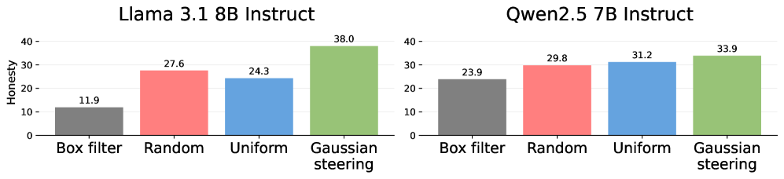
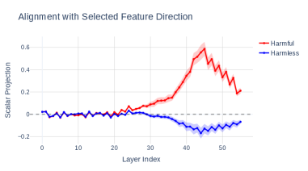
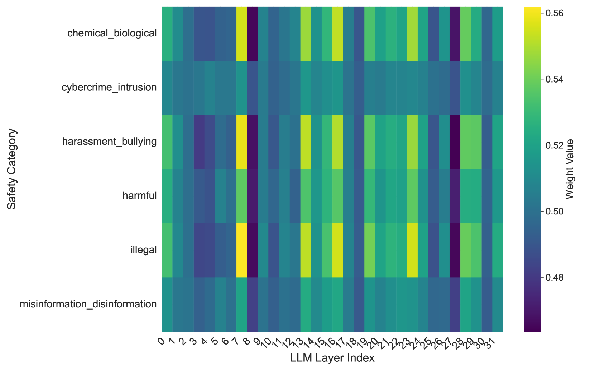

## The Single-Layer Bottleneck

Every steering method we have covered so far applies its intervention at a single layer. [Addition steering](/topics/addition-steering/) adds a vector at layer $\ell$. [CAA](/topics/caa-method/) averages contrast pairs, then injects at one chosen layer. The [refusal direction](/topics/refusal-direction/) is ablated at a specific site. The implicit assumption is that there exists a single best layer for each intervention, and the researcher's job is to find it.

This assumption is fragile. The "best layer" depends on the model, the concept being steered, and even the specific prompt. Góral et al. (2025) found that single-layer steering on Qwen 2.5 actually *decreased* honesty by 2.5 percentage points -- the intervention at the chosen layer actively hurt performance . The researcher picked a reasonable layer, but "reasonable" was not good enough. A concept that is well-represented at layer 15 in one model might peak at layer 22 in another, or might be distributed across a range of layers with no single site capturing the full picture.

What if, instead of betting on one layer, we spread the intervention across many?

## Distributing the Intervention

The idea is straightforward. Rather than adding the full steering vector at a single layer, we add a fraction of it at each layer, weighted by a **depth schedule**:

$$
\mathbf{h}'_k = \mathbf{h}_k + \alpha_k \cdot \mathbf{v}
$$

where $\mathbf{h}_k$ is the residual stream at layer $k$, $\mathbf{v}$ is the steering vector, and $\alpha_k$ is the weight assigned to layer $k$ by the depth schedule. When $\alpha_k = 0$ for all layers except one, this reduces to standard single-layer steering.

> **Depth Schedule:** A function $\alpha_k$ that assigns a steering weight to each layer $k$ of a model. The schedule controls how the intervention is distributed across depth -- concentrated at one layer, spread uniformly, or shaped by some principled criterion.

This is not entirely new. Zou et al. (2023) applied steering across multiple layers in their Representation Engineering work, adding vectors at all layers simultaneously . But they did not systematically study *how* to distribute the weights across depth. The question is not just "multi-layer or single-layer?" but "how much at each layer?"

The methods we will cover answer this question with increasing sophistication: from fixed mathematical schedules, to data-driven layer selection, to fully learned per-layer weights.

## Fixed Schedules: The Gaussian Approach

Góral et al. (2025) proposed the simplest principled schedule: a Gaussian curve centered on a chosen layer :

$$
\alpha_k = \exp\!\Bigl(-\frac{(k - \mu)^2}{2\sigma^2}\Bigr)
$$

where $\mu$ is the center layer (typically chosen via a validation sweep) and $\sigma$ controls how broadly the intervention spreads. At $\sigma = 0$, this collapses to single-layer steering. As $\sigma$ grows, the intervention spreads across more layers, with a smooth falloff away from the center.

The key experimental test is an **equal-budget comparison**: keep the total intervention energy $\sum_k \alpha_k$ constant and vary only the shape of the schedule. This controls for the possibility that multi-layer steering works simply because it adds more total perturbation.

<figure>
  
  <figcaption>Equal-budget comparison of depth schedules on two models. With the same total steering energy, the Gaussian schedule consistently outperforms uniform, random, and box-filter allocations. From Góral et al., <em>Depth-Wise Activation Steering for Honest Language Models</em>. </figcaption>
</figure>

The results are consistent across models: Gaussian outperforms box filter, random, and uniform allocation. The Gaussian schedule achieves 38.0 honesty on Llama 3.1 8B (versus 24.3 for uniform) and 33.9 on Qwen 2.5 7B (versus 31.2 for uniform). The smooth, concentrated shape matters -- it is not enough to just spread the budget around.

Across seven models (spanning Llama, Qwen, and Mistral families), the Gaussian schedule improved honesty over single-layer baselines in six of seven cases. The one exception was a model where single-layer steering already worked well.

Pause and think: Why does spreading help?

Consider what happens when you add a large steering vector at a single layer. The perturbation hits the residual stream all at once, and every subsequent layer must process activations that may be far from anything seen during training. Now consider the same total perturbation spread across 10 layers: each individual nudge is small enough that subsequent layers can accommodate it without being pushed out of distribution.

There is an analogy to numerical integration: many small steps approximate a smooth trajectory better than one large jump. The model's forward pass is a sequence of transformations, and distributing the intervention means each transformation receives a nearly-normal input, keeping the computation on the learned manifold.

What would you expect to happen if $\sigma$ were set extremely large -- say, equal to the total number of layers? The schedule would become nearly uniform. Based on the equal-budget results, this should perform worse than a well-centered Gaussian but better than a box filter. The Gaussian's advantage comes from concentrating energy where it matters most while still providing the smoothing benefits of distribution.

## Three Regimes Across Depth

But why does steering work better at some layers than others? Dang and Ngo (2026) provide a direct answer by examining how concept representations evolve across depth .

They compute the scalar projection of each class's mean activation (e.g., harmful vs. harmless) onto the steering direction at every layer. The result reveals three distinct regimes:

<figure>
  
  <figcaption>Class projections onto the steering direction across depth in Qwen 2.5 7B Instruct. The harmful and harmless classes separate clearly only in middle layers, with early layers showing no discrimination and late layers showing reduced separation. From Dang and Ngo, <em>Selective Steering</em>. </figcaption>
</figure>

**Early layers (roughly 0-15):** Both classes project near zero onto the steering direction. The concept simply is not encoded yet -- the model is still processing surface-level features. Steering here adds a vector in a direction that has no semantic meaning at this depth.

**Middle layers (roughly 20-40):** The classes separate sharply. Harmful examples project positively onto the steering direction; harmless examples project near zero or negatively. This is the discriminative zone where the concept is most clearly represented and where steering can most precisely shift behavior.

**Late layers (roughly 45+):** The separation diminishes. The model has already committed to an output trajectory, and the concept representation weakens as computation shifts toward token prediction.

This explains both why single-layer steering is fragile (the discriminative zone is a range, not a point) and why Gaussian schedules work well (they concentrate energy in the middle while tapering smoothly into the non-discriminative zones). Uniform steering wastes budget on early layers where the concept is absent and late layers where the model is already committed.

## Principled Layer Selection

The three-regime picture suggests a more targeted approach: steer *only* at discriminative layers, and skip the rest entirely.

Dang and Ngo (2026) formalize this with a **discriminative criterion** . At each layer $k$, they compute the scalar projections of the positive and negative class means onto the steering direction. A layer is discriminative if the two classes project with **opposite signs** -- one class projects positively, the other negatively. This means the steering direction genuinely separates the classes at that layer.

Layers where both classes project in the same direction, or where projections are near zero, are skipped. Steering at these layers would push both classes in the same direction without differentially affecting the target behavior.

The method also addresses a second problem: **norm preservation**. Standard addition steering adds a vector to the residual stream, which increases the activation norm. As we saw in the three-regime analysis, activation norms vary substantially across depth -- they grow rapidly in early layers and amplify near the output. Adding a fixed-magnitude vector at a high-norm layer is proportionally tiny; at a low-norm layer, it is proportionally enormous.

Dang and Ngo replace vector addition with a **rotation** of the activation in the plane spanned by the activation and the steering direction. This preserves the activation norm exactly, avoiding the norm-mismatch problem.

The combination of selective layer choice and norm-preserving intervention yields large improvements: a 5.5x improvement in steering effectiveness over uniform multi-layer steering on Qwen 2.5 7B, while maintaining lower perplexity (less coherence degradation) than competing methods.

Pause and think: When would fixed schedules beat data-driven selection?

Principled layer selection requires computing class projections from labeled data -- you need examples of the positive and negative class to determine which layers are discriminative. This is straightforward when steering for a well-defined binary concept like honesty or harmfulness, where labeled examples are readily available.

But what about concepts that are hard to label? Consider steering for "creativity" or "nuanced reasoning." These concepts may not decompose neatly into two classes, making it difficult to compute discriminative projections. In such cases, a Gaussian schedule requires only a center layer (findable through a simple validation sweep) and makes no assumptions about class structure. Similarly, when you have very few labeled examples, the projection estimates may be noisy enough that the simpler Gaussian is more robust.

There is a general pattern here: more data and clearer concept definitions favor more sophisticated methods, while data scarcity and concept ambiguity favor simpler schedules with fewer parameters.

## Learned Layer Weights

Both Gaussian schedules and selective steering impose a fixed structure on the depth schedule: either a mathematical form or a binary include/exclude decision. Hegazy et al. (2025) take the next step: **learn** the per-layer weights from data .

They train a small MLP controller that takes a prompt as input and outputs a weight $\alpha_k$ for each layer. The controller is trained to optimize a safety objective while keeping the model's general capabilities intact.

The learned weights reveal something that fixed schedules cannot capture: **different concepts peak at different depths**.

<figure>
  
  <figcaption>Learned per-layer steering weights for different safety categories in Llama 3.1 8B. Each category induces a distinct weight pattern across depth, reflecting where each concept is most strongly encoded. From Hegazy et al., <em>Guiding Giants</em>. </figcaption>
</figure>

Dangerous content (chemical/biological threats) concentrates weight in early-to-middle layers. Cybercrime and intrusion peak in middle layers. Harassment and illegal content show broader distributions. These patterns make intuitive sense: different types of knowledge and behavior are processed at different depths, and the optimal steering schedule should reflect this.

The learned approach also makes the schedule **input-adaptive**: different prompts can receive different weight profiles. A prompt about chemistry gets steered more heavily at the layers that encode chemical knowledge, while a prompt about social dynamics gets steered at layers relevant to social behavior. Fixed schedules, by definition, cannot adapt to the input.

## Steering as Control

There is a deeper conceptual frame for thinking about multi-layer steering. Nguyen et al. (2025) observe that standard steering is equivalent to **proportional control** (the P in PID control) . You measure the deviation from desired behavior (the steering vector), multiply by a gain ($\alpha$), and apply the correction. One shot, open loop.

But control theory has long known that proportional-only control is fragile. If the system drifts (analogous to the model's later layers partially undoing the steering), P control cannot compensate. Adding an **integral** term (I) accumulates past corrections, preventing steady-state drift. Adding a **derivative** term (D) anticipates future changes, damping oscillations.

Nguyen et al. implement this by treating the forward pass as a dynamical system. At each layer, a PID controller measures the current activation's alignment with the target direction and computes a correction that accounts for the cumulative effect of past interventions (I) and the rate of change (D). The controller adjusts the steering magnitude at each layer based on how much the previous layers' corrections have already shifted the model.

The practical result is improved stability: the D term prevents overcorrection (steering too hard when early layers already made a large shift), and the I term prevents undercorrection (accumulated drift when each layer partially absorbs the perturbation). On TruthfulQA, the PID controller outperforms both single-layer and uniform multi-layer steering.

This framing connects multi-layer steering to a broader principle: the forward pass of a transformer is a *sequential process*, and interventions on sequential processes benefit from feedback and adaptation, not just feedforward injection.

Pause and think: Connecting the methods

We have now seen four approaches to multi-layer steering. Consider placing them on a spectrum from simplest to most flexible:

1. **Gaussian schedule** -- fixed mathematical form, two parameters ($\mu$, $\sigma$), no data beyond a validation sweep
2. **Selective steering** -- data-driven binary decisions per layer, requires labeled class examples, norm-preserving
3. **PID controller** -- adaptive during the forward pass, requires tuning three gains (P, I, D), feedback-based
4. **Learned controller** -- fully data-driven per-layer weights, concept-specific and input-adaptive, requires training

As we move along the spectrum, the methods gain flexibility but require more data and computation. The Gaussian schedule is a reasonable default when you have limited resources. Selective steering suits well-defined binary concepts with labeled examples. The PID approach offers online adaptation without training. Learned controllers provide maximum flexibility when training data and compute are available.

Which approach would you choose for steering a safety-critical deployment where labeled data is abundant? What about a research setting where you are exploring a novel, loosely-defined concept?

## Limitations

Multi-layer steering improves on single-layer approaches, but several open problems remain.

**Same vector across all layers.** All methods discussed here use the same steering vector $\mathbf{v}$ at every layer, varying only the scalar weight $\alpha_k$. But concept directions may rotate across depth -- the direction that encodes "honesty" at layer 10 may not be the same direction at layer 30. Per-layer vector adaptation remains largely unexplored.

**Interaction with other steering types.** Multi-layer distribution has been studied primarily for [addition steering](/topics/addition-steering/). How it interacts with [affine steering](/topics/affine-steering/) (which includes a re-centering step) or [ablation steering](/topics/ablation-steering/) (which projects out a direction) is unknown. The re-centering in affine steering, for instance, is calibrated for single-layer intervention -- distributing it across layers would require rethinking the affine correction.

**Narrow evaluation.** Most results focus on honesty, harmlessness, or similar binary safety benchmarks. Whether multi-layer steering improves outcomes for more subtle behavioral dimensions (helpfulness, creativity, nuanced reasoning) is an open question.

**No unified theory.** We have empirical evidence that Gaussian schedules work, that discriminative layers matter, and that learned weights vary by concept. But there is no theoretical framework explaining *why* a particular depth distribution is optimal, or predicting the best schedule from model architecture alone.

## Looking Ahead

Multi-layer steering shifts the central question from "which layer?" to "how much at each layer?" This is a meaningful step: it turns a fragile, discrete choice into a continuous optimization problem with principled solutions.

The natural next step is combining multi-layer scheduling with richer intervention types. [Sparse autoencoders](/topics/sparse-autoencoders/) and [transcoders](/topics/transcoders/) decompose activations into interpretable features, enabling steering at the feature level rather than the direction level. Combining feature-level precision with depth-wise scheduling -- steering specific features at the layers where they are most active -- could offer far more targeted control than either approach alone.
